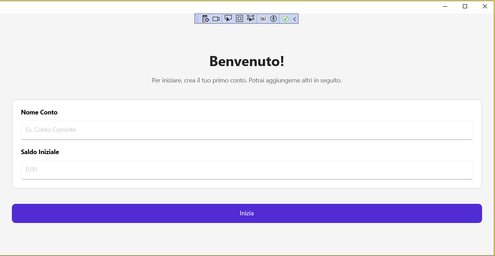

# Wallet Wise

Un'app di finanza personale per dominare il caos, un commit alla volta.

Il mio obiettivo principale è crescere come montatore meccanico, ma questo progetto è la prova della mia filosofia nello sviluppo software: **la sostanza vince sull'apparenza**.

## 🏍️ Il Nostro Biglietto da Visita: Usabilità e Sostanza

Wallet Wise è progettato per essere facilmente utilizzabile anche da chi non sa nulla di finanza. L'architettura è stata costruita per garantire che l'app sia veloce, affidabile e che l'utente sia guidato in ogni fase.

## 🖼️ Anteprima Rapida

### Onboarding (Primo Avvio)

L'utente è guidato a creare il primo conto senza vedere schermate vuote.

### Flusso Principale

Demo rapida di creazione conto, budget e transazione.

## 🎯 Obiettivi e Funzionalità Attuali

Niente fronzoli. Solo le funzioni essenziali per avere il controllo.

* ✅ **Onboarding Intuitivo (NEW)**: L'utente è guidato a creare il primo conto, evitando schermate vuote e intimidatorie. La logica di avvio è a prova di bug.
* ✅ **Budgeting Solido**: I budget sono visualizzati con barre di progresso chiare e riutilizzano le impostazioni del mese precedente, rendendo l'app "intelligente" e riducendo il lavoro manuale.
* ⏳ **Pilota Automatico (In Lavorazione)**: Infrastruttura completa per la gestione delle transazioni ricorrenti (stipendio, affitto, ecc.). Questo è il cuore della nostra usabilità futura.
* 📊 **Dashboard chiara**: Una visione d'insieme del patrimonio netto.
* 💳 **Gestione multi-conto**: Tracciamento semplice di conti correnti, risparmi e investimenti.

## 💻 Stack Tecnologico e Architettura (Sostanza)

La qualità del software si fonda su scelte architetturali consapevoli che garantiscono manutenibilità e affidabilità.

* **Framework**: .NET MAUI - Per lo sviluppo di UI native e multipiattaforma.
* **Architettura**: MVVM con Community Toolkit MVVM - Separazione netta tra UI, logica e dati.
* **Database**: SQLite + Entity Framework Core.
* **Costrutti a Prova di Bug**: Utilizzo massimo di Dependency Injection per l'iniezione dei ViewModel e adozione di layout generati in Code-Behind (C#) per le liste complesse, bypassando noti bug di rendering XAML e garantendo la stabilità.

## 📈 Stato del progetto: In Corso

* [x] Setup iniziale del progetto e della struttura delle cartelle.
* [x] Definizione dei model di base (`Account`, `Transaction`, `Budget`, `RecurringTransaction`).
* [x] Configurazione del database con Entity Framework Core (Migrazioni completate).
* [x] Implementazione dell'Onboarding e del sistema di avvio a prova di bug.
* [x] Implementazione della Dashboard principale e della visualizzazione dei Budget con barre di progresso.
* [x] Aggiunta dell'infrastruttura di Unit Testing (xUnit).
* [x] **Completato**: Sviluppo della funzionalità "Pilota Automatico" (Logica di salvataggio e visualizzazione).

## 🤝 Contributi e Feedback

Questo progetto è un'avventura di apprendimento e crescita. Ogni feedback, suggerimento o critica costruttiva è essenziale per migliorare.

---

**Sostanza sopra tutto. Sempre.**